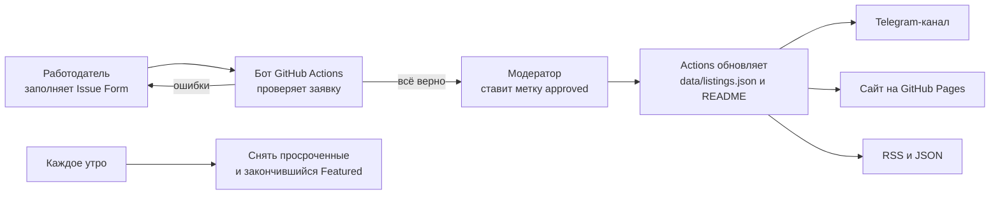

# JuniorJol 🇰🇿

**Стажировки и junior-вакансии в IT Казахстана — свежие, проверенные, с дедлайнами.**
Қазақстандағы IT-тағылымдамалар мен junior-вакансиялар.

[📌 Разместить вакансию бесплатно](../../issues/new?template=new-listing.yml) ·
[💼 Для работодателей](docs/employers.md) ·
[🔔 RSS](data/feed.xml) ·
[🧩 JSON](data/listings.json)

<!-- SPONSOR: строку ниже владелец меняет вручную, когда есть спонсор месяца -->
> 🤝 Здесь может быть ваша компания — [станьте спонсором месяца](../../issues/new?template=sponsor.yml).

## Вакансии

<!-- LISTINGS:START -->
**Активных: 4** · стажировок: 4 · junior: 0 · part-time: 0 · обновлено 4 октября 2026 · [JSON](data/listings.json) · [RSS](data/feed.xml)

|   | Компания | Позиция | Тип | Где | Оплата | Дедлайн |   |
|---|---|---|---|---|---|---|---|
|  | **Andersen** | Full Stack Test Engineer Trainee | Стажировка · QA | Алматы · Офис | 💰 до 300 000 ₸ за месяц, до вычета налогов | — | [Откликнуться](https://hh.kz/vacancy/137531419) |
|  | **Andersen** | DevOps Trainee | Стажировка · DevOps / SRE | Алматы · Гибрид | 💰 300 000 ₸ за месяц, до вычета налогов | — | [Откликнуться](https://hh.kz/vacancy/137568604) |
|  | **Andersen** | .NET Trainee | Стажировка · Backend | Астана · Офис | 💰 до 270 000 ₸ за месяц, до вычета налогов | — | [Откликнуться](https://hh.kz/vacancy/138021943) |
|  | **Andersen** | Trainee: JavaScript, QA, бизнес-анализ, UI/UX | Стажировка · Другое | Удалённо | — | — | [Откликнуться](https://people.andersenlab.com/trainee) |

⭐ — Featured: работодатель продвигает вакансию. «—» в дедлайне — вакансия висит 45 дней или до закрытия набора.
<!-- LISTINGS:END -->

## Студентам

- Всё бесплатно и без регистрации: нажмите **Откликнуться** — откроется страница вакансии у работодателя.
- Каждая вакансия проверена модератором, просроченные снимаются автоматически каждое утро.
- Чтобы не пропускать новые: подпишитесь на [RSS](data/feed.xml) или Telegram-канал (ссылка появится здесь после запуска) и поставьте ⭐ репозиторию.
- Нашли вакансию с ошибкой или уже закрытую? [Сообщите](../../issues/new?template=close-listing.yml).

## Работодателям

1. Заполните [форму заявки](../../issues/new?template=new-listing.yml) — это 2 минуты.
2. Бот сразу проверит заявку и покажет, как она будет выглядеть.
3. Модератор опубликует её в течение 1–2 рабочих дней: в таблице выше, на сайте, в RSS и в Telegram.

Базовое размещение бесплатное. Платно — закрепить вакансию вверху списка (Featured) или стать спонсором. [Тарифы и правила →](docs/employers.md)

## Как это устроено

Весь сервис работает внутри GitHub: без своего сервера, базы данных и платного хостинга.



| Что | Где |
|---|---|
| Данные | [`data/listings.json`](data/listings.json) (активные), [`data/archive.json`](data/archive.json) (архив) |
| Логика | [`scripts/board.py`](scripts/board.py) — Python, только стандартная библиотека |
| Автоматизация | [`.github/workflows/`](.github/workflows) |
| Формы заявок | [`.github/ISSUE_TEMPLATE/`](.github/ISSUE_TEMPLATE) |
| Сайт | [`site/index.html`](site/index.html) |
| Запуск и модерация | [`docs/setup.md`](docs/setup.md) |
| Бизнес-модель | [`docs/business-model.md`](docs/business-model.md) |

## Разработчикам

Данные открыты — используйте их в своих ботах и агрегаторах:

```
https://raw.githubusercontent.com/<owner>/<repo>/<default-branch>/data/listings.json
```

Поля: `id`, `company`, `title`, `type`, `direction`, `city`, `format`, `paid`, `salary`, `url`, `deadline`, `added`, `expires`, `featured_until`.

Pull request'ы с улучшениями приветствуются. Перед PR: `python3 -m unittest discover -s tests` и `python3 scripts/board.py render --check`.

## Правила модерации

Не публикуем: вакансии без официального источника, требования к полу, возрасту и внешности, «стажировки», за которые платит сам стажёр, MLM и курсы под видом работы.

## Лицензия

Код — [MIT](LICENSE). Данные о вакансиях — [CC BY 4.0](https://creativecommons.org/licenses/by/4.0/deed.ru): можно использовать со ссылкой на JuniorJol.
